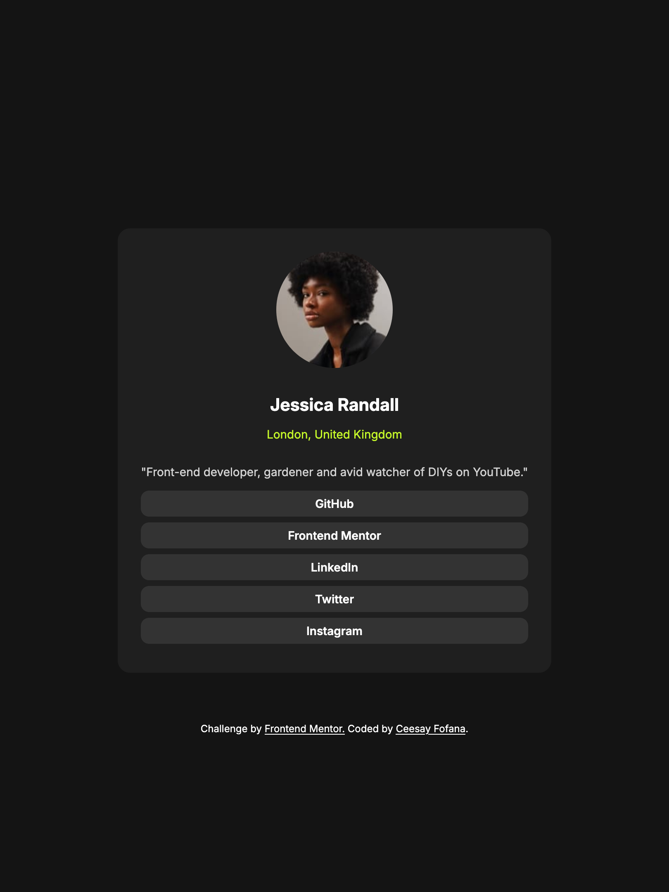

# Frontend Mentor - Social links profile solution

This is a solution to the [Social links profile challenge on Frontend Mentor](https://www.frontendmentor.io/challenges/social-links-profile-UG32l9m6dQ). Frontend Mentor challenges help you improve your coding skills by building realistic projects. 

## Table of contents

- [Overview](#overview)
  - [The challenge](#the-challenge)
  - [Screenshot](#screenshot)
  - [Links](#links)
- [My process](#my-process)
  - [Built with](#built-with)
  - [Continued development](#continued-development)
- [Author](#author)

## Overview

### The challenge

Users should be able to:

- See hover and focus states for all interactive elements on the page

### Screenshot

### Links

- Solution URL: [Solution url](https://cfofana.github.io/social-links-profile/)
- Live Site URL: [Live Site](https://cfofana.github.io/social-links-profile/)

## My process

### Built with

- Semantic HTML5 markup
- CSS custom properties
- Flexbox
- Mobile-first workflow

If you want more help with writing markdown, we'd recommend checking out [The Markdown Guide](https://www.markdownguide.org/) to learn more.

### Continued development

Semantic HTML
Aria Labels

## Author

- Website - [Ceesay Fofana](https://www.ceesayfofana.com)
- Frontend Mentor - [@cfofana](https://www.frontendmentor.io/profile/cfofana)
- GitHub - [@cfofana](https://github.com/cfofana)
- LinkedIn - [Ceesay Fofana](https://www.linkedin.com/in/ceesay/)

